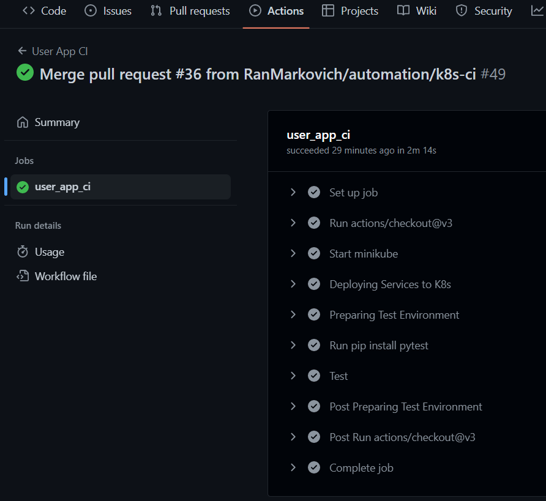
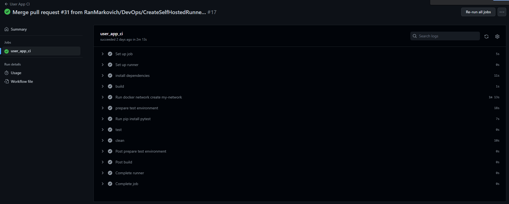
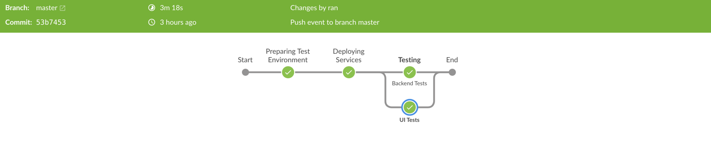
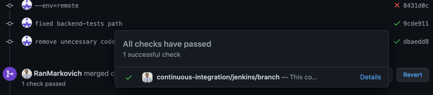

## About the project:

This is a full stack automation project that tests both UI and API of a demo flask application for a user registration and login flows.

## About the application:

Written mostly in Python - The application contains two web-services:
    
* **user-service**: handles the frontend requests and integrates with sql database for user data registration and login.
* **user-app**: serves the html pages for registration and login, to send the user data to the user-service.

## About CI Infrastructure:

### New Version (Jan 2023):
Migrated application infrastructure from docker-compose to kubernetes:
CI Build and Tests steps are:
1. Setting-up local K8s (minikube)
2. Building + Deploying applications into local K8s (minikube)
3. Forwarding Pod's port for testing in localhost env
4. Testing application

a sample of a successful run:


### Old Version (Nov 2022):
Migrated CI infrastructure from running on Jenkins to running on Github Actions using a self-hosted runner setup.

**Importat:** this is against gh-actions best practices as this is a non-private repo, but it is for the sake of the practice!

## Running Tests Locally:
Prerequisites:
* Installed and configured minikube + kubectl on your local machine

Configure Action Runner Controller:
* For a complete setup use [this guide](https://github.com/actions-runner-controller/actions-runner-controller)
  * Once done, you will be able to see available runner in your repo settings - under `Actions -> Runners`
* Create a `.github/workflows` dir in the root of your project
* Create a `.yml` file under the workflows dir
* Configure workflow to run on a self-hosted runner: <br>
  `runs-on:`
    <br>`self-hosted`

a sample of a successful run:


### Old Version (Sep 2021):
Using the Jenkins multibranch-pipeline, whenever a new remote branch is created (git push), the jenkins server receives a git webhook to initialize a build which would then build, run and test the application.

a sample of a successful run:


The build status is reflected in the PR, like so:


## Running Tests Locally:
* Step 1: ```docker network create my-network && docker-compose up -d --build```
* Step 2: ```pytest --alluredir="tests/reports/allure_results" tests/frontend_tests/test_user_app_title.py```